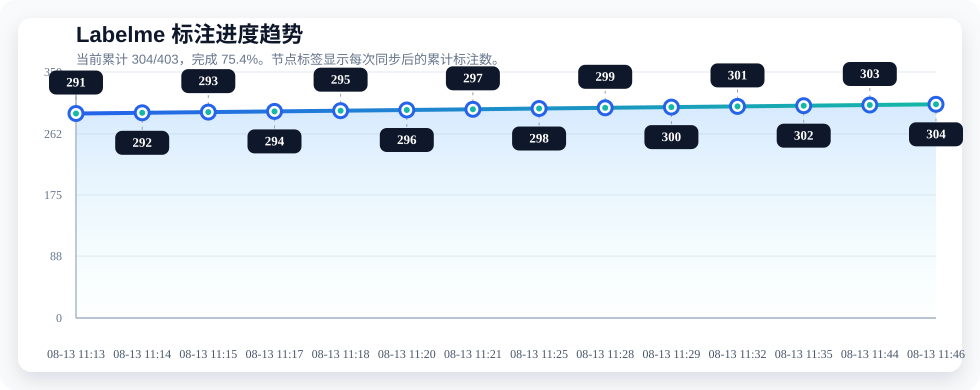

# 标注项目进度 (26.8.2XinJiang)

> [!NOTE]
> 本仓库按完整交付目录组织：图片放在 `images/`，Labelme 标注 JSON 放在 `annotations/`。图片总数在 `config.json` 中配置，GitHub Actions 会在每次推送时自动统计 `annotations/` 中的 JSON 数量并更新此看板。

### 标注状态看板

| 统计项 | 数值 | 占比 / 进度条 |
| :--- | :---: | :--- |
| **总图片数 (Total)** | **403** | `[████████████████████]` 100.0% |
| **已标记 (Completed)** | **287** | `[██████████████░░░░░░]` 71.2% |
| **未标记 (Remaining)** | **116** | `[██████░░░░░░░░░░░░░░]` 28.8% |

**当前总体进度：**
-blue?style=for-the-badge&logo=github)

### 标注进度趋势折线图

### 目录结构

- `images/`：本地完整图片文件，用于打包交付；默认不上传到 GitHub。
- `annotations/`：Labelme JSON 标注文件，GitHub 看板统计这个目录。
- `sync_from_labelme.ps1`：从 `E:\Labelme\3卢杰` 同步图片和 JSON，并更新看板。
- `watch_labelme_and_push.ps1`：运行时每 20 秒监听一次 JSON 变化，自动同步并推送。

---
_最后更新：2026-08-13 11:04:08 (UTC+8)_

### 每日标注聚合日志

<b>2026-08-13</b> : 进度 287/403 (71.2%) | 新增 11 | 加强 3

**新增文件**

`XinJiang-疏勒县-16-10`, `XinJiang-疏勒县-16-11`, `XinJiang-疏勒县-17-10`, `XinJiang-疏勒县-17-12`, `XinJiang-疏勒县-17-13`, `XinJiang-疏勒县-18-13`, `XinJiang-铁门关市-3-7`, `XinJiang-铁门关市-4-2`, `XinJiang-铁门关市-4-3`, `XinJiang-铁门关市-4-8`, `XinJiang-铁门关市-5-2`

**加强文件**

`XinJiang-疏勒县-17-10`, `XinJiang-疏勒县-17-13`, `XinJiang-铁门关市-4-8`

<b>2026-08-12</b> : 进度 276/403 (68.5%) | 新增 15 | 加强 0

**新增文件**

`XinJiang-沙雅县-16-2`, `XinJiang-沙雅县-16-3`, `XinJiang-沙雅县-16-4`, `XinJiang-沙雅县-16-5`, `XinJiang-沙雅县-19-18`, `XinJiang-沙雅县-20-9`, `XinJiang-沙雅县-4-4`, `XinJiang-疏附县-1-1`, `XinJiang-疏附县-10-12`, `XinJiang-疏附县-10-35`, `XinJiang-疏附县-10-36`, `XinJiang-疏附县-10-37`, `XinJiang-疏附县-10-38`, `XinJiang-疏附县-5-4`, `XinJiang-疏附县-5-5`

<b>2026-08-11</b> : 进度 261/403 (64.8%) | 新增 39 | 加强 3

**新增文件**

`XinJiang-沙雅县-2-4`, `XinJiang-沙雅县-2-5`, `XinJiang-沙雅县-4-3`, `XinJiang-轮台县-16-12`, `XinJiang-轮台县-16-18`, `XinJiang-轮台县-16-19`, `XinJiang-轮台县-24-22`, `XinJiang-轮台县-26-21`, `XinJiang-轮台县-28-40`, `XinJiang-轮台县-28-41`, `XinJiang-轮台县-28-42`, `XinJiang-轮台县-29-12`, `XinJiang-轮台县-29-27`, `XinJiang-轮台县-29-29`, `XinJiang-轮台县-29-30`, `XinJiang-轮台县-30-28`, `XinJiang-轮台县-30-31`, `XinJiang-轮台县-30-8`, `XinJiang-轮台县-32-27`, `XinJiang-轮台县-32-28`, `XinJiang-轮台县-32-31`, `XinJiang-轮台县-32-32`, `XinJiang-轮台县-32-33`, `XinJiang-轮台县-32-34`, `XinJiang-轮台县-32-35`, `XinJiang-轮台县-33-43`, `XinJiang-轮台县-43-19`, `XinJiang-轮台县-51-10`, `XinJiang-麦盖提县-10-6`, `XinJiang-麦盖提县-10-7`, `XinJiang-麦盖提县-12-12`, `XinJiang-麦盖提县-14-15`, `XinJiang-麦盖提县-14-9`, `XinJiang-麦盖提县-16-16`, `XinJiang-麦盖提县-17-4`, `XinJiang-麦盖提县-25-5`, `XinJiang-麦盖提县-5-23`, `XinJiang-麦盖提县-8-12`, `XinJiang-麦盖提县-8-13`

**加强文件**

`XinJiang-轮台县-29-12`, `XinJiang-轮台县-29-30`, `XinJiang-麦盖提县-25-5`

<b>2026-08-10</b> : 进度 222/403 (55.1%) | 新增 21 | 加强 1

**新增文件**

`XinJiang-奎屯市-10-10`, `XinJiang-奎屯市-10-9`, `XinJiang-奎屯市-11-10`, `XinJiang-奎屯市-11-9`, `XinJiang-奎屯市-2-12`, `XinJiang-奎屯市-2-14`, `XinJiang-奎屯市-3-12`, `XinJiang-奎屯市-3-13`, `XinJiang-奎屯市-7-11`, `XinJiang-奎屯市-8-10`, `XinJiang-奎屯市-8-11`, `XinJiang-奎屯市-8-7`, `XinJiang-奎屯市-8-9`, `XinJiang-奎屯市-9-10`, `XinJiang-奎屯市-9-8`, `XinJiang-奎屯市-9-9`, `XinJiang-库尔勒市-26-16`, `XinJiang-库尔勒市-27-18`, `XinJiang-库尔勒市-29-41`, `XinJiang-库尔勒市-31-35`, `XinJiang-库尔勒市-35-34`

**加强文件**

`XinJiang-奎屯市-10-10`

<b>2026-08-09</b> : 进度 201/403 (49.9%) | 新增 40 | 加强 10

**新增文件**

`XinJiang-库尔勒市-10-10`, `XinJiang-库尔勒市-13-11`, `XinJiang-库尔勒市-17-14`, `XinJiang-库尔勒市-17-20`, `XinJiang-库尔勒市-18-21`, `XinJiang-库尔勒市-18-22`, `XinJiang-库尔勒市-18-9`, `XinJiang-库尔勒市-19-8`, `XinJiang-库尔勒市-27-17`, `XinJiang-库车县-28-39`, `XinJiang-库车县-28-4`, `XinJiang-库车县-28-5`, `XinJiang-库车县-28-6`, `XinJiang-库车县-29-26`, `XinJiang-库车县-31-29`, `XinJiang-库车县-31-30`, `XinJiang-库车县-31-31`, `XinJiang-库车县-31-32`, `XinJiang-库车县-31-33`, `XinJiang-库车县-31-34`, `XinJiang-库车县-33-11`, `XinJiang-库车县-33-27`, `XinJiang-库车县-33-28`, `XinJiang-库车县-33-29`, `XinJiang-库车县-34-28`, `XinJiang-库车县-34-29`, `XinJiang-库车县-34-38`, `XinJiang-库车县-35-23`, `XinJiang-库车县-35-24`, `XinJiang-库车县-35-25`, `XinJiang-库车县-36-27`, `XinJiang-库车县-37-20`, `XinJiang-库车县-38-14`, `XinJiang-库车县-38-15`, `XinJiang-库车县-40-18`, `XinJiang-库车县-41-15`, `XinJiang-库车县-41-17`, `XinJiang-库车县-41-18`, `XinJiang-库车县-44-16`, `XinJiang-库车县-57-36`

**加强文件**

`XinJiang-伽师县-3-41`, `XinJiang-博湖县-1-6`, `XinJiang-博湖县-6-3`, `XinJiang-拜城县-27-2`, `XinJiang-阿克苏市-24-10`, `XinJiang-阿克苏市-5-20`, `XinJiang-阿瓦提县-10-11`, `XinJiang-阿瓦提县-5-3`, `XinJiang-阿瓦提县-7-3`, `XinJiang-阿瓦提县-7-9`

<b>2026-08-08</b> : 进度 161/403 (40.0%) | 新增 26 | 加强 1

**新增文件**

`XinJiang-喀什市-2-5`, `XinJiang-喀什市-2-7`, `XinJiang-喀什市-2-8`, `XinJiang-喀什市-2-9`, `XinJiang-喀什市-7-6`, `XinJiang-库车县-17-41`, `XinJiang-库车县-19-35`, `XinJiang-库车县-20-35`, `XinJiang-库车县-23-11`, `XinJiang-库车县-24-0`, `XinJiang-库车县-24-1`, `XinJiang-库车县-24-19`, `XinJiang-库车县-24-30`, `XinJiang-库车县-24-31`, `XinJiang-库车县-24-32`, `XinJiang-库车县-24-33`, `XinJiang-库车县-25-14`, `XinJiang-库车县-25-15`, `XinJiang-库车县-26-28`, `XinJiang-库车县-27-29`, `XinJiang-精河县-1-0`, `XinJiang-精河县-1-5`, `XinJiang-精河县-1-6`, `XinJiang-精河县-10-18`, `XinJiang-精河县-13-20`, `XinJiang-精河县-2-4`

**加强文件**

`XinJiang-库车县-24-19`

<b>2026-08-07</b> : 进度 135/403 (33.5%) | 新增 10 | 加强 1

**新增文件**

`XinJiang-喀什市-1-7`, `XinJiang-喀什市-1-8`, `XinJiang-喀什市-1-9`, `XinJiang-精河县-13-18`, `XinJiang-精河县-13-19`, `XinJiang-精河县-14-20`, `XinJiang-精河县-2-3`, `XinJiang-精河县-5-18`, `XinJiang-精河县-8-18`, `XinJiang-精河县-8-19`

**加强文件**

`XinJiang-精河县-14-20`

<b>2026-08-06</b> : 进度 125/403 (31.0%) | 新增 21 | 加强 1

**新增文件**

`XinJiang-和硕县-3-22`, `XinJiang-和硕县-5-16`, `XinJiang-和静县-10-20`, `XinJiang-和静县-10-5`, `XinJiang-和静县-13-37`, `XinJiang-和静县-14-14`, `XinJiang-和静县-14-42`, `XinJiang-和静县-18-23`, `XinJiang-和静县-18-24`, `XinJiang-和静县-18-27`, `XinJiang-和静县-54-55`, `XinJiang-和静县-55-53`, `XinJiang-和静县-55-54`, `XinJiang-和静县-55-56`, `XinJiang-和静县-56-53`, `XinJiang-和静县-56-54`, `XinJiang-库车县-17-40`, `XinJiang-库车县-33-30`, `XinJiang-库车县-9-44`, `XinJiang-精河县-14-18`, `XinJiang-精河县-14-19`

**加强文件**

`XinJiang-和静县-18-27`

<b>2026-08-05</b> : 进度 104/403 (25.8%) | 新增 33 | 加强 9

**新增文件**

`XinJiang-伽师县-1-15`, `XinJiang-伽师县-1-16`, `XinJiang-伽师县-1-17`, `XinJiang-伽师县-1-18`, `XinJiang-伽师县-14-19`, `XinJiang-伽师县-14-20`, `XinJiang-伽师县-14-21`, `XinJiang-伽师县-15-15`, `XinJiang-伽师县-15-16`, `XinJiang-伽师县-2-14`, `XinJiang-伽师县-2-39`, `XinJiang-伽师县-3-39`, `XinJiang-伽师县-3-40`, `XinJiang-伽师县-3-41`, `XinJiang-伽师县-6-18`, `XinJiang-和静县-6-30`, `XinJiang-和静县-7-1`, `XinJiang-和静县-7-2`, `XinJiang-昌吉市-12-7`, `XinJiang-昌吉市-13-1`, `XinJiang-昌吉市-13-13`, `XinJiang-昌吉市-13-14`, `XinJiang-昌吉市-13-2`, `XinJiang-昌吉市-13-3`, `XinJiang-昌吉市-13-4`, `XinJiang-昌吉市-14-4`, `XinJiang-昌吉市-4-15`, `XinJiang-昌吉市-5-13`, `XinJiang-昌吉市-5-14`, `XinJiang-昌吉市-5-8`, `XinJiang-昌吉市-5-9`, `XinJiang-昌吉市-6-12`, `XinJiang-昌吉市-6-15`

**加强文件**

`XinJiang-伽师县-1-16`, `XinJiang-伽师县-1-17`, `XinJiang-伽师县-2-14`, `XinJiang-伽师县-2-39`, `XinJiang-伽师县-3-39`, `XinJiang-伽师县-3-40`, `XinJiang-伽师县-6-18`, `XinJiang-巴楚县-15-27`, `XinJiang-巴楚县-2-54`

<b>2026-08-04</b> : 进度 71/403 (17.6%) | 新增 28 | 加强 20

**新增文件**

`XinJiang-博湖县-1-4`, `XinJiang-博湖县-1-6`, `XinJiang-博湖县-3-3`, `XinJiang-博湖县-6-1`, `XinJiang-博湖县-6-2`, `XinJiang-博湖县-6-3`, `XinJiang-博湖县-6-4`, `XinJiang-博湖县-6-5`, `XinJiang-博湖县-6-6`, `XinJiang-博湖县-7-1`, `XinJiang-博湖县-7-2`, `XinJiang-博湖县-7-3`, `XinJiang-博湖县-7-4`, `XinJiang-博湖县-7-5`, `XinJiang-博湖县-8-5`, `XinJiang-拜城县-15-13`, `XinJiang-拜城县-26-34`, `XinJiang-拜城县-26-35`, `XinJiang-拜城县-26-36`, `XinJiang-拜城县-27-12`, `XinJiang-拜城县-27-13`, `XinJiang-拜城县-27-2`, `XinJiang-拜城县-33-45`, `XinJiang-拜城县-33-7`, `XinJiang-拜城县-34-43`, `XinJiang-拜城县-34-44`, `XinJiang-拜城县-34-45`, `XinJiang-拜城县-35-45`

**加强文件**

`XinJiang-博湖县-6-5`, `XinJiang-博湖县-7-3`, `XinJiang-博湖县-7-5`, `XinJiang-巴楚县-16-22`, `XinJiang-巴楚县-19-23`, `XinJiang-拜城县-15-13`, `XinJiang-拜城县-27-2`, `XinJiang-拜城县-35-45`, `XinJiang-拜城县-9-42`, `XinJiang-拜城县-9-43`, `XinJiang-阿克苏市-10-28`, `XinJiang-阿克苏市-16-10`, `XinJiang-阿克苏市-21-10`, `XinJiang-阿克苏市-21-5`, `XinJiang-阿克苏市-22-9`, `XinJiang-阿瓦提县-6-7`, `XinJiang-阿瓦提县-6-8`, `XinJiang-阿瓦提县-7-9`, `XinJiang-阿瓦提县-8-1`, `XinJiang-阿瓦提县-8-2`

<b>2026-08-03</b> : 进度 43/403 (10.7%) | 新增 28 | 加强 28

**新增文件**

`XinJiang-巴楚县-11-32`, `XinJiang-巴楚县-15-27`, `XinJiang-巴楚县-15-28`, `XinJiang-巴楚县-15-29`, `XinJiang-巴楚县-16-15`, `XinJiang-巴楚县-16-16`, `XinJiang-巴楚县-16-18`, `XinJiang-巴楚县-16-19`, `XinJiang-巴楚县-16-22`, `XinJiang-巴楚县-19-21`, `XinJiang-巴楚县-19-23`, `XinJiang-巴楚县-2-52`, `XinJiang-巴楚县-2-53`, `XinJiang-巴楚县-2-54`, `XinJiang-巴楚县-22-6`, `XinJiang-巴楚县-3-52`, `XinJiang-巴楚县-5-53`, `XinJiang-拜城县-9-42`, `XinJiang-拜城县-9-43`, `XinJiang-阿瓦提县-1-7`, `XinJiang-阿瓦提县-10-11`, `XinJiang-阿瓦提县-13-5`, `XinJiang-阿瓦提县-14-4`, `XinJiang-阿瓦提县-7-3`, `XinJiang-阿瓦提县-7-9`, `XinJiang-阿瓦提县-8-1`, `XinJiang-阿瓦提县-8-2`, `XinJiang-阿瓦提县-8-6`

**加强文件**

`XinJiang-巴楚县-15-27`, `XinJiang-巴楚县-15-28`, `XinJiang-巴楚县-15-29`, `XinJiang-巴楚县-16-15`, `XinJiang-巴楚县-16-16`, `XinJiang-巴楚县-16-19`, `XinJiang-巴楚县-16-22`, `XinJiang-巴楚县-22-6`, `XinJiang-巴楚县-5-53`, `XinJiang-拜城县-9-42`, `XinJiang-阿克苏市-10-28`, `XinJiang-阿克苏市-16-10`, `XinJiang-阿克苏市-21-10`, `XinJiang-阿克苏市-21-5`, `XinJiang-阿克苏市-21-6`, `XinJiang-阿克苏市-22-9`, `XinJiang-阿克苏市-24-10`, `XinJiang-阿克苏市-3-23`, `XinJiang-阿克苏市-5-20`, `XinJiang-阿瓦提县-10-11`, `XinJiang-阿瓦提县-14-4`, `XinJiang-阿瓦提县-3-7`, `XinJiang-阿瓦提县-5-3`, `XinJiang-阿瓦提县-5-4`, `XinJiang-阿瓦提县-5-7`, `XinJiang-阿瓦提县-6-7`, `XinJiang-阿瓦提县-6-8`, `XinJiang-阿瓦提县-8-1`

<b>2026-08-02</b> : 进度 15/403 (3.7%) | 新增 15 | 加强 0

**新增文件**

`XinJiang-阿克苏市-10-28`, `XinJiang-阿克苏市-16-10`, `XinJiang-阿克苏市-21-10`, `XinJiang-阿克苏市-21-5`, `XinJiang-阿克苏市-21-6`, `XinJiang-阿克苏市-22-9`, `XinJiang-阿克苏市-24-10`, `XinJiang-阿克苏市-3-23`, `XinJiang-阿克苏市-5-20`, `XinJiang-阿瓦提县-3-7`, `XinJiang-阿瓦提县-5-3`, `XinJiang-阿瓦提县-5-4`, `XinJiang-阿瓦提县-5-7`, `XinJiang-阿瓦提县-6-7`, `XinJiang-阿瓦提县-6-8`

